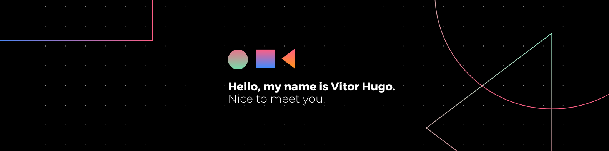

<h1 align="left">Hello, my name is Vitor Hugo 🤘</h1>

  

- 🔥 Junior Software Developer Mobile | Backend | Frontend | API

- 🔭 I am currently working as an IT intern at [Athenas Agricola](https://athenasagricola.com.br/)

- 📐 Studying Bachelor of Science in Computer Science at the [Universidade Paulista](https://www.unip.br/)

  

## 🛠 &nbsp;Tech Stack

 
  
  
  
  
  
  
  
  
  
  
  

  

## ⚙️ &nbsp;GitHub Analytics

<!-- 

  

  

 -->

<!--

-->

  

## 😉 &nbsp;Social Links

 
  
  
   

  

## 💻 &nbsp;Contribution activity

