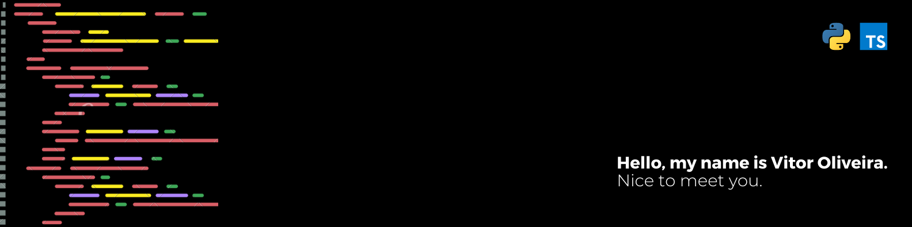

  

# Hi, I'm hugomos 👋

I am a software developer, technology enthusiast, and very practical. Currently, I work in the development team at [Athenas Consultoria Agrícola e Laboratórios](https://athenasagricola.com.br), where I build tools and plugins focused on precision agriculture. I use [Python](https://www.python.org), [Typescript](https://www.typescriptlang.org), [QGIS](https://qgis.org/pt_BR/site/), and [ArcGIS](https://www.esri.com/pt-br/arcgis/about-arcgis/overview) in the development of these solutions.

## Contact

Feel free to get in touch with me. I'm always open to discussions, collaborations, or any other interaction related to software projects. You can find me on the following channels:

- e-mail - [vitor_osantos@hotmail.com](mailto:vitor_osantos@hotmail.com)
- linkedin - [/in/hugomos/](https://www.linkedin.com/in/hugomos/)
- portfolio - [hugomos.com](https://www.hugomos.com/)
